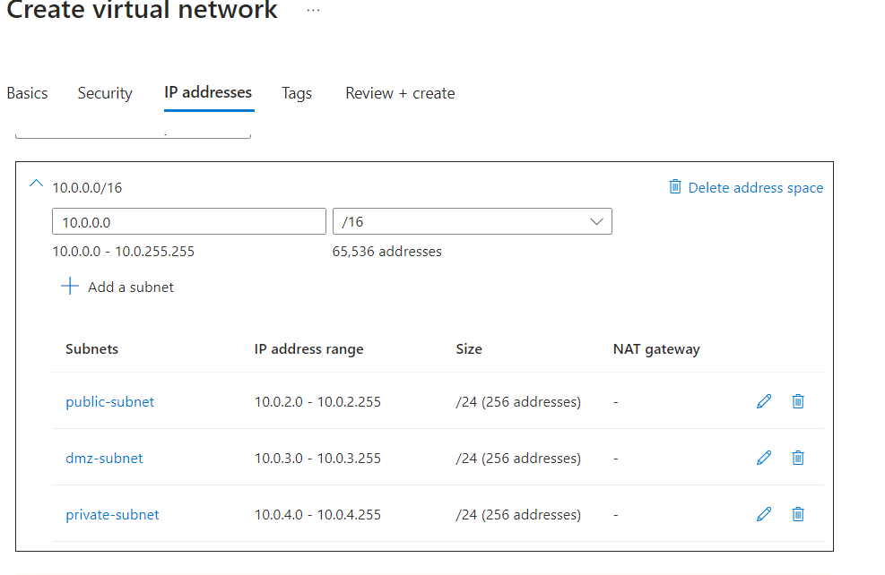
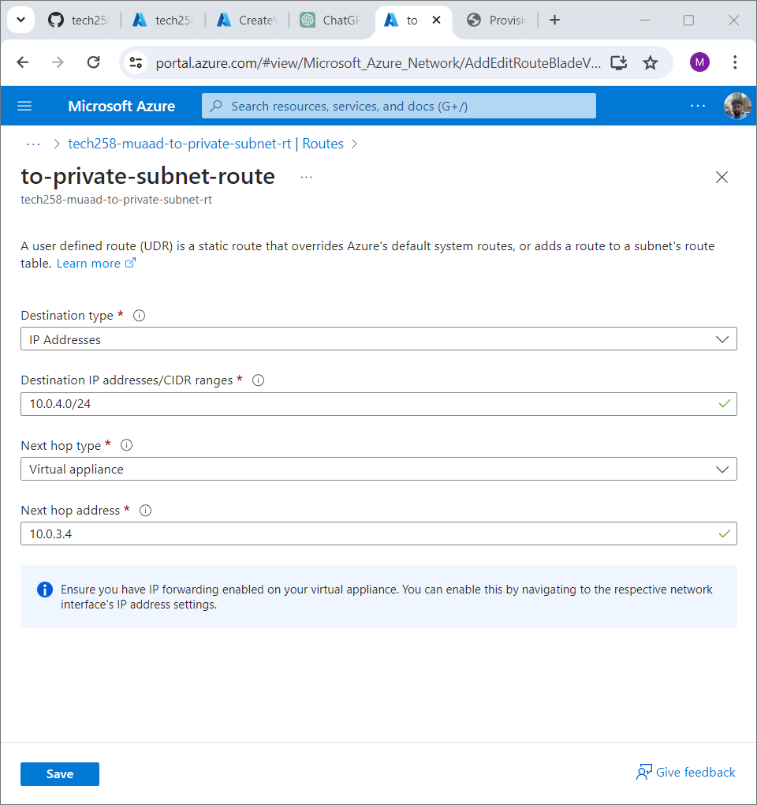
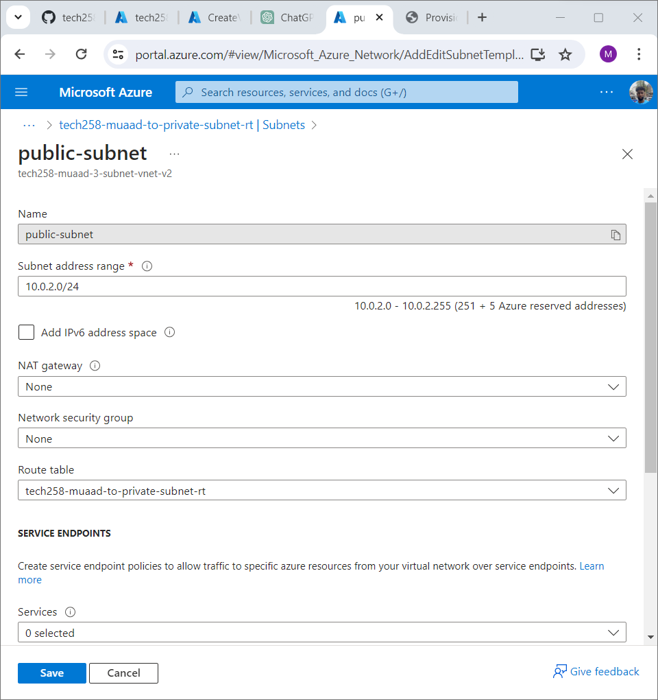
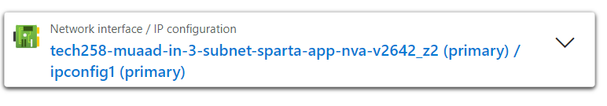
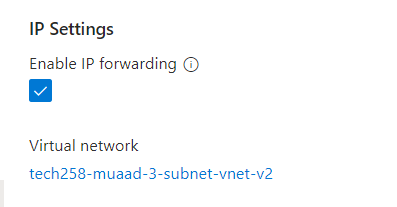
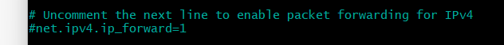

# Create the 3-Subnet Architecture to Make the Database Private

## Create Virtual Network
- Define and create the virtual network with three subnets:
  - Subnet 1: Application 10.0.2.0
  - Subnet 2: Database (Private) 10.0.4.0
  - Subnet 3: Network Virtual Appliance (NVA) 10.0.3.0
  

## Create VMs for App, Database, NVA
- Deploy virtual machines for:
  - Application server
    - Enter the user data with the script.
  - Database server
    - On network settings, make sure no public is selected
  - Network Virtual Appliance (NVA)
- When creating the VM's pick availability zones. Zone 1 for the app, 2 for the NVA and 3 for the Database. 
## Test Public IP Accessibility
- Test to ensure public IP addresses are accessible 
- Verify if the database and app VMs can interact using ping
    - SSH into your App VM. 
    - Use the command ``` ping 10.0.4.0```
    - This will then show you the packets of data transfered between the App and DB.
  
  

## Create Route Table
- Set up a route table to manage traffic routing within the virtual network:
  -  Define routes for communication between subnets
  
  -  Associate the route table with appropriate subnets

## Enable IP Forwarding
- Enable IP forwarding on the Network Virtual Appliance (NVA) VM:
  
- Then click enable 
  
- Access the VM via SSH
  - Use ```sysctl net.ipv4.ip_forward``` This will then return zero to show no packets are being transferred.
  - Check and enable IP forwarding in the configuration
  - use ```sudo nano /etc/sysctl.conf```
     uncomment the line to enable packet forwarding.
  - use ```sudo sysctl -p``` this will then show as one which then shows that the packets are now transferring between the app and DB. 

## Configure IP Tables

Configure IP tables on the NVA for additional security and routing:

- Create Nano File 
- Insert the script 
``` bash 
  # Allow all traffic on the loopback interface (localhost)
sudo iptables -A INPUT -i lo -j ACCEPT
sudo iptables -A OUTPUT -o lo -j ACCEPT

# Allow incoming packets that are part of established connections or related to such traffic
sudo iptables -A INPUT -m state --state ESTABLISHED,RELATED -j ACCEPT

# Allow outgoing packets that are part of established connections
sudo iptables -A OUTPUT -m state --state ESTABLISHED -j ACCEPT

# Drop incoming packets that are marked as INVALID, which usually means they don't match any known connections
sudo iptables -A INPUT -m state --state INVALID -j DROP

# Allow incoming SSH traffic (port 22) for new and established connections
sudo iptables -A INPUT -p tcp --dport 22 -m state --state NEW,ESTABLISHED -j ACCEPT
sudo iptables -A OUTPUT -p tcp --sport 22 -m state --state ESTABLISHED -j ACCEPT

# Allow forwarding of TCP traffic from subnet 10.0.2.0/24 to 10.0.4.0/24 on port 27017 (MongoDB)
sudo iptables -A FORWARD -p tcp -s 10.0.2.0/24 -d 10.0.4.0/24 --destination-port 27017 -m tcp -j ACCEPT

# Allow forwarding of ICMP (ping) traffic from subnet 10.0.2.0/24 to 10.0.4.0/24 for new and established connections
sudo iptables -A FORWARD -p icmp -s 10.0.2.0/24 -d 10.0.4.0/24 -m state --state NEW,ESTABLISHED -j ACCEPT

# Set the default policy for incoming packets to DROP, meaning unless explicitly allowed, all incoming packets are dropped
sudo iptables -P INPUT DROP

# Set the default policy for forwarded packets to DROP, meaning unless explicitly allowed, all forwarded packets are dropped
sudo iptables -P FORWARD DROP
```   
- Give the correct permissions using ```sudo chmod +x config-ip-tables.sh```
- Run the Script ```./config-ip-tables.sh```
- Before you run any commands make sure you use sudo update and upgrade   

## Check Public IP Accessibility Again
- Verify if public IP addresses are still accessible:

