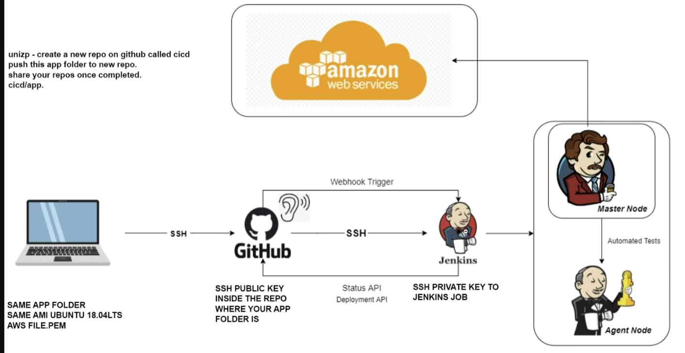

# CI/CD Pipeline 

## Understanding CI, CD, and Continuous Deployment (CD)

### Continuous Integration (CI)

Continuous Integration is a development practice where developers frequently integrate their code changes into a shared repository. Each integration triggers automated build and test processes to detect errors quickly.

### Continuous Delivery (CD)

Continuous Delivery extends CI by automating the deployment process, allowing teams to release software updates to production or staging environments quickly and reliably.

### Continuous Deployment (CD)

Continuous Deployment takes CD one step further by automatically deploying every code change that passes through the CI/CD pipeline to production environments without manual intervention. 

## What is a CI/CD Pipeline?

A CI/CD pipeline automates the integration of code changes into a shared repository (Continuous Integration) and the deployment of applications to production environments (Continuous Deployment/Delivery). Jenkins is a popular open-source automation server often used to implement CI/CD pipelines. 

## Why CI/CD?

- **Efficiency**: Automation reduces manual errors and speeds up software delivery.
- **Scalability**: Jenkins allows the scaling of CI/CD processes across multiple agents and environments.
- **Flexibility**: Integration with AWS enables deployment to cloud infrastructure easily.

## When to Use CI/CD?

CI/CD pipelines are essential for any project, especially:
- **Large Teams**: Facilitates collaboration among multiple developers.
- **Frequent Releases**: Enables rapid iteration and continuous delivery.
- **Cloud Deployment**: Integrates seamlessly with cloud platforms like AWS.

## How CI/CD Works with Jenkins.

1. **Code Commit**: Developers push code changes to a version control system like Git.
2. **Continuous Integration (CI)**:
   - **Jenkins Master**: Jenkins coordinates the CI/CD process.
   - **Agent Nodes**: Jenkins agents (running on separate machines or containers) execute build and test tasks.
   - **Build & Test**: Agents pull code from the repository, build the application, and run automated tests.
   - **Artifact Generation**: Build artifacts are stored in Jenkins or a repository manager.
3. **Continuous Deployment (CD)**:
   - **AWS Integration**: Jenkins interacts with AWS services for deployment.
   - **Deployment Pipeline**: Jenkins pipelines define stages for deploying to different environments (e.g., staging, production).
   - **Deploy to AWS**: Deploy application artifacts to AWS services like EC2. 
4. **Monitoring and Feedback**: Continuous monitoring of application performance and user feedback loop to inform future development iterations.

