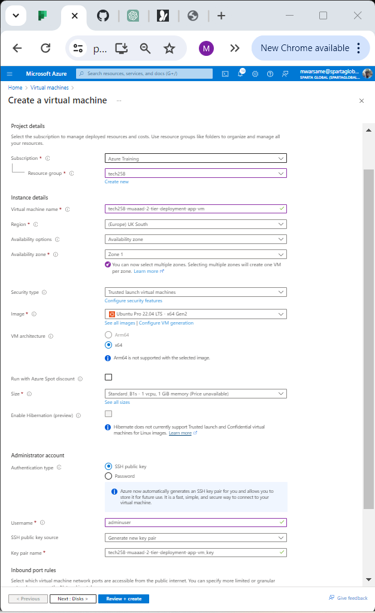

# Deploying an App with Azure

## Setting Up SSH Key to Use on Azure
```bash 
ssh-keygen -t rsa -b 4096 -C "<YOUR_EMAIL>"
```


## Setting Up Virtual Network

### Description:
- Create a virtual network in Azure for hosting the application and database.
    - Public

    - Private 


## Setting Up Virtual Machine for the App

### Description:
  - Create virtual machines for hosting the application and database services.
    - Ubuntu Pro 22.04 Lts
  - Choose appropriate VM sizes and configurations.
    - Security: standard
    - Size: Standard_B1s
    - Default username: change to "adminuser"
    - Keypair: use your SSH Key 
    - Disk size change from premium SSD to standard SSD
#### Repeat Same Steps for the Database Aswell
  

## Setting Up the Network Security Group for the App

### Description:
  - Create a network security group (NSG) to control inbound and outbound traffic for the application VM.
  -  Define security rules to allow/deny specific traffic based on requirements.
      
  - In Azure, when using Azure Cosmos DB's API for MongoDB, you do not need to declare or open port 27017 for MongoDB. Azure Cosmos DB's API for MongoDB is a fully managed service that abstracts the underlying infrastructure and networking details from you.

## Connecting to Both Virtual Machines

### Description:
  - Establish SSH connections to the application and database VMs for configuration and management.
  ```bash
  ssh -i "~/.ssh/tech258-muaad-az-key" adminuser@172.187.92.256
  ```
  - Replace the IP with the one on your virtual machine and repeat this step with the database IP aswell.


## Running the App and Databases Script

### Description:
- Use the nano command and insert your script.
  
 ```bash
  #!/bin/bash

echo "Updating..."
sudo apt update -y
echo "Done!"

echo "Upgrading packages..."
sudo DEBIAN_FRONTEND=noninteractive apt upgrade -y
echo "Done!"

echo "Installing Nginx..."
sudo DEBIAN_FRONTEND=noninteractive apt install nginx -y
echo "Done!"

# Configure reverse proxy
sudo sed -i '51s/.*/\t  proxy_pass http:\/\/localhost:3000;/' /etc/nginx/sites-enabled/default

# Change configuration file

echo "Restarting Nginx..."
sudo systemctl restart nginx
echo "Done!"ls

echo "Enabling Nginx..."
sudo systemctl enable nginx
echo "Nginx enabled and started on boot."

# Install Node.js version 20.x
echo "Installing Node.js..."
curl -fsSL https://deb.nodesource.com/setup_20.x | sudo DEBIAN_FRONTEND=noninteractive -E bash - && sudo DEBIAN_FRONTEND=noninteractive apt-get install -y nodejs
echo "Node.js installed!"

# Check Node.js version
echo "Node.js version:"
node -v

# Clone the Git repository
echo "Cloning the Git repository..."
git clone https://github.com/Muaad1738/tech258-sparta-test-app.git ~/tech258-sparta-test-app
echo "Git repository cloned!"

# Navigate to the app folder
echo "Navigating to the app folder..."
cd ~/tech258-sparta-test-app/Sparta_test_folder/app


# set db host env var
export DB_HOST=mongodb://172.31.63.98:27017/posts

# Install app dependencies
echo "Installing app dependencies..."
npm install
echo "App dependencies installed!"

# Install PM2
echo "Installing PM2..."
sudo npm install -g pm2
echo "PM2 installed"


# run the app
#echo "Running the app with PM2..."
pm2 start app.js
echo "App started with PM2!"
```
```bash 
#!/bin/bash
# config needrestart.config
# non interactive into command which install things

# Update
echo Updating...
sudo apt update -y
echo Done!

# Upgrade
echo Upgrading packages...
sudo DEBIAN_FRONTEND=noninteractive apt upgrade -y
echo Done!

# Install MongoDB 7.0.6
echo Installing MongoDB 7.0.6...
curl -fsSL https://www.mongodb.org/static/pgp/server-7.0.asc | \
   sudo gpg -o /usr/share/keyrings/mongodb-server-7.0.gpg \
   --dearmor

echo "deb [ arch=amd64,arm64 signed-by=/usr/share/keyrings/mongodb-server-7.0.gpg ] https://repo.mongodb.org/apt/ubuntu jammy/mongodb-org/7.0 multiverse" | sudo tee /etc/apt/sources.list.d/mongodb-org-7.0.list

sudo apt-get update 

sudo DEBIAN_FRONTEND=noninteractive apt-get install -y mongodb-org=7.0.6 mongodb-org-database=7.0.6 mongodb-org-server=7.0.6 mongodb-mongosh=2.2.4 mongodb-org-mongos=7.0.6 mongodb-org-tools=7.0.6


# Configure bind IP in MongoDB config file
echo Configuring MongoDB...
sudo sed -i 's/bindIp: 127.0.0.1/bindIp: 0.0.0.0/' /etc/mongod.conf

# Restart MongoDB
echo Restarting MongoDB...
sudo systemctl restart mongod

# Enable MongoDB
echo Enabling MongoDB...
sudo systemctl enable mongod
```

#### Execute scripts to deploy and configure the application and database services on respective VMs.
- Run the database script first and do not forget change the DB_HOST IP when setting up the environmental variable.

## Using the Public IP to Open Your App

### Description:
  - Retrieve the public IP address of the application VM.
  - Access the deployed application using the public IP through a web browser.
  
