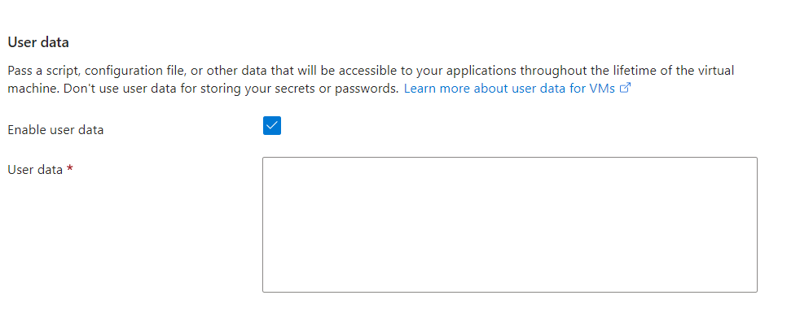
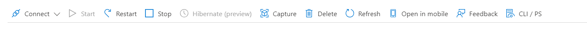
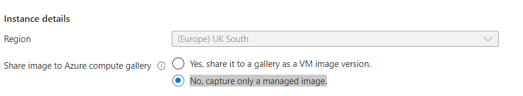

# Deploying an App

## Methods of Execution

### Manually 
- Access the server via SSH and manually input each command by copying and pasting them into the terminal.
- Requires manual interaction, executing commands individually.

### Scripting 
-  Use SSH to connect to the server and run a predefined script by copying and pasting it into the terminal.
-  Copy and paste the script into the terminal, which then runs each command sequentially.

### User Data (no SSH in)
-  Provide instructions or scripts for execution during the creation of a virtual machine instance.
-  Commands or scripts specified in the user data section are automatically executed during VM provisioning, without requiring manual intervention or SSH access.

### Image
-  A snapshot of a virtual machine's state, including the operating system, installed software, and configuration settings.
-  Images are used as templates to create new virtual machine instances with identical configurations, speeding up deployment and ensuring consistency.

## Using User Data 
-  Using user data when creating a VM on Azure automates the process, ensuring consistency, efficiency, and scalability compared to manual input via shell commands.
- You also need to use the absoloute path to locate the app.
  ```bash 
  cd /home/ubuntu/tech258-sparta-test-app/Sparta_test_folder/app
  ```
- Follow the general steps in creating your VM for both the Database and the App. 
- When you reach the advanced step, tick the user data and insert the working script.
  
- Once everything is completed. After a shortwhile, you can ssh in the Database VM to check if MongoDB is running.

## Using an Image 

- Prepare the Existing VM:
     -    Ensure that your existing VM, which hosts the database, is properly configured and running on Azure.
     -   Verify that your database and all necessary configurations are in place and working correctly.
- Before you capture the image, go to your ssh terminal and run 
  
   ``` sudo waagent -deprovision+user ``` 
   
   This is a command used in Azure virtual machines to prepare them for image capture. It removes system-specific information while retaining user accounts, making the VM suitable as a template for creating new instances.

-    Capture VM Image:
  
     -  In the VM blade, locate the Capture button and click on it.
     -   Follow the prompts to capture the VM image. You'll be asked to provide details such as the image name, resource group, etc.
    
     - Capturing only a managed image provides more control over where the image is stored and who has access to it, which can be important for privacy and security purposes.
     -   Once the image capture process is complete, Azure will create a generalised image of your VM that can be used to create new VM instances.
- Create a New VM from the Captured Image:
    -    In the Azure Portal, navigate to the Images section under the Compute category.
     -   Locate the image that you captured in the previous step and click on it.
     -   In the image blade, click on the Create VM button.
        Follow the prompts to create a new VM from the captured image. You'll need to provide details such as the VM name, resource group, virtual network settings, etc.
     -   Customise the User Data in the Advanced section.
  
  Insert the following script for the App vm only. No user data is needed for the database VM
```bash 
    echo Changing directory to app folder...
    cd /home/ubuntu/tech258-sparta-test-app/Sparta_test_folder/app
    echo Done!

    export DB_HOST=mongodb://10.0.3.4:27017/posts

    echo Installing app 
    npm install

    echo Stopping previous PM2 processes...
    pm2 kill
    echo "Done!"

    echo Starting the app..
    pm2 start app.js
    echo "Done!"
``` 

 -   Once the VM creation process is complete, you'll have a new VM instance created from the captured image.

### What is an Azure Image and its equivalent on AWS?

An Azure Image is a snapshot of a virtual machine (VM) that includes the OS disk, configurations, and installed applications. On AWS, the equivalent is called an Amazon Machine Image (AMI).

### What is included in the image, and what is not?

The image includes the OS disk, configurations, and installed applications. What's not included are temporary or dynamic data, such as runtime logs or user-generated content, to keep the image lightweight and reusable.

### What is the side-effect of creating an image of a VM on Azure?
    
After creating the image, the original VM is generalised, which means it's sysprep'd, making it unable to log back in without reconfiguration.   

### Specialised vs Generalised image

Specialised images are customised images pre-configured for specific purposes or applications in Azure, while generalised images are generic images without customisation.

The difference lies in the level of customisation: specialised images are tailored for specific tasks or applications, whereas generalised images are more generic and can serve as a starting point for various scenarios in Azure.

### Changing the file permissions
- Use sudo -E: To gain superuser permissions while retaining environment variables for the command.
- Using Chmod: Adjust permissions using chmod to modify access levels.
- Login as the root user: Temporarily log in as root to access privileges.
- Take ownership of the folder: Transfer ownership of the folder to gain access rights.


