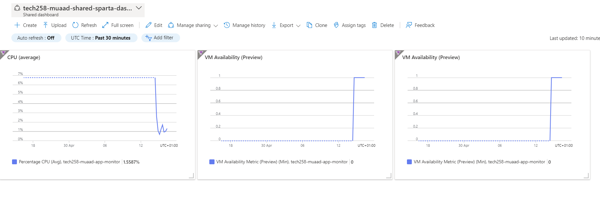
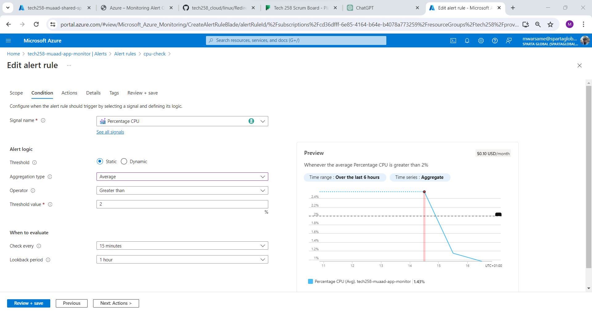

# Monitoring and Responding to Load/Traffic on Azure

## 1. Priority of Monitoring and Responding to Load/Traffic

From worst to best, the priority for monitoring and responding to load/traffic on Azure is as follows:

1. Reactive Approach: Waiting for users to report issues before taking action.
2. Threshold-Based Alerting: Setting thresholds for key metrics (e.g., CPU, memory, network) using Azure Monitor and triggering alerts when thresholds are exceeded.
3. Proactive Monitoring: Utilising Azure Monitor to monitor key metrics in real-time and taking preemptive action based on trends and anomalies.
4. Predictive Scaling: Leveraging Azure Autoscale to automatically scale resources based on predicted load changes.

## 2. Setting Up a Dashboard on Azure Monitor

To set up a dashboard on Azure Monitor:
- Open the Azure Monitor service.
- Create a new dashboard and add tiles for the metrics you want to monitor.
- Customise the layout and arrangement of tiles for optimal visualisation.

## 3. Load Testing and Dashboard Utilisation

Combining load testing with Azure Monitor dashboard monitoring allows us to:
- Use Azure Application Insights for load testing and monitoring web applications.
- Simulate realistic user traffic to assess system performance under load.
- Monitor key metrics in real-time using Azure Monitor to identify performance bottlenecks and issues.
- Optimise Azure resources and configurations based on load testing results and dashboard insights.

## 4. Dashboard during Extreme Load Testing

## Setting Up CPU Usage Alert on Azure Monitor

### 1. Create a CPU Usage Alert

To create a CPU usage alert for your Azure app instance:
- Navigate to the Azure portal and open the Azure Monitor service.
- Create a new alert rule for the relevant resource.
- Specify the CPU usage metric and set the threshold for triggering the alert.
- Define the alert criteria, such as the duration and frequency of the threshold violation.
- Configure the notification action to send alerts to your email address.

### 2. Check Average CPU Usage

Ensure the alert checks the average CPU usage for each minute to accurately capture performance fluctuations and potential issues.

