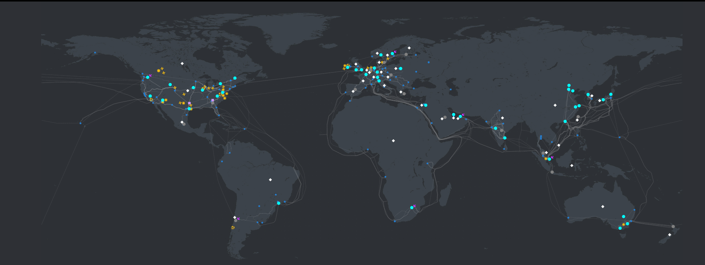

# Intro to Azure

## The Basics of Azure

Azure is a cloud computing platform and service created by Microsoft. It provides a wide range of cloud services, including computing power, storage, and networking resources, allowing users to build, deploy, and manage applications and services through Microsoft-managed data centers.

### Azure Regions and Availability Zones

Azure operates in regions, which are areas of the world where Azure data centers are located. Each region is made up of one or more data centers. Availability zones are unique physical locations within an Azure region, each made up of one or more data centers equipped with independent power, cooling, and networking.

#### Diagram:

## How is Azure Structured/Organised?

Azure is organised into several categories of services, including Compute, Storage, Networking, Databases, and more. These services are further organised into resource groups, subscriptions, and management groups to help users manage and organise their Azure resources.

## What Types of Services Does Azure Provide?

Azure provides a wide range of services, including:

- Compute: Virtual Machines, Azure Kubernetes Service, Azure Functions
- Storage: Blob Storage, File Storage, Disk Storage
- Networking: Virtual Network, Load Balancer, VPN Gateway
- Databases: Azure SQL Database, Cosmos DB, Azure Database for MySQL

## Ways to Access Azure

Users can access Azure through various interfaces, including:

- Azure Portal: A web-based management portal for accessing and managing Azure resources.
- Azure CLI: A command-line interface for managing Azure resources.
- Azure PowerShell: A command-line interface for managing Azure resources using PowerShell scripts.
- Azure REST API: Allows developers to programmatically manage Azure resources using HTTP requests.

## Explain the Difference Between Azure and Azure DevOps

Azure is a cloud computing platform and service offered by Microsoft, providing a wide range of cloud services for building, deploying, and managing applications and services.

 Azure DevOps, on the other hand, is a set of development tools and services for software development, including version control, build automation, release management, and more. 
 
 While Azure provides the infrastructure and services for deploying applications, Azure DevOps provides the tools and processes for developing and delivering software.

## Why Use the Azure Pricing Calculator?

The Azure Pricing Calculator is a tool provided by Microsoft to estimate the cost of using Azure services based on usage patterns and configurations. It allows users to select the services they plan to use, configure them according to their requirements, and estimate the monthly or yearly cost of using those services.

 The Azure Pricing Calculator helps users plan and budget for their Azure deployments, optimise costs, and make informed decisions about which Azure services to use.

## Diffrences when deploying a VM with azure than with AWS
- In Azure, assigning a static IP to a VM is a straightforward process. When creating or configuring a VM, you can choose to assign a static IP address to it. Azure allows you to reserve an IP address and associate it with the VM, ensuring that the IP remains constant even if the VM is stopped and started.