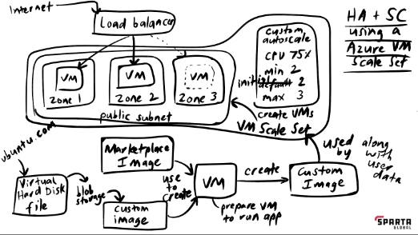

# High Availability and Scalability with Azure Virtual Machines

In Azure, high availability and scalability are crucial for ensuring that your applications remain accessible and responsive, even during hardware failures or changes in demand.

## High Availability

Azure provides high availability by distributing virtual machines (VMs) across multiple availability zones within a region. An availability zone is a physically separate data centre with independent power, cooling, and networking, offering resilience against failures in a single zone.

### Benefits of High Availability:

- **Fault Tolerance**: By deploying VMs across different zones, Azure ensures that your application remains available even if one zone experiences a failure.
  
- **Automatic Recovery**: If a VM fails due to hardware issues or other reasons, Azure automatically replaces it with a new instance to maintain application availability.

## Scalability

Scalability in Azure allows you to adjust the capacity of your infrastructure dynamically based on changing workload demands. Azure Virtual Machine Scale Sets (VMSS) offer elastic scaling capabilities, enabling you to scale your application up or down seamlessly.

### Deploying Virtual Machines in Different Zones

When deploying VMSS, you can specify the desired number of instances and configure them to be distributed across multiple availability zones within a region. This ensures that your application can withstand zone-level failures and provides improved fault tolerance.

### Scaling Up Based on CPU Usage

Azure VMSS allows you to scale your application automatically based on CPU usage metrics. You can define scaling rules that trigger scaling actions when the CPU percentage hits a certain threshold. For example:

- **Scale-Out**: If the CPU percentage exceeds a specified threshold (e.g., 75%), Azure automatically adds more VM instances to handle the increased workload.
  
- **Scale-In**: Conversely, if the CPU usage decreases below a certain threshold (e.g., 30%), Azure removes excess VM instances to optimise resource utilisation and reduce costs.

### Understanding Load Balancers:

- **What is a Load Balancer:**
  - A load balancer distributes incoming network traffic across multiple VM instances.
  - It ensures high availability and reliability by evenly distributing requests.

- **Why Load Balancer is Needed:**
  - Load balancers prevent any single VM from becoming a bottleneck by distributing traffic evenly.
  - They enhance fault tolerance and scalability by automatically routing traffic away from failed instances.

## Conclusion

By leveraging Azure's high availability and scalability features, you can deploy resilient and responsive applications that can adapt to changing demands and maintain performance even in the face of failures or fluctuations in workload.

