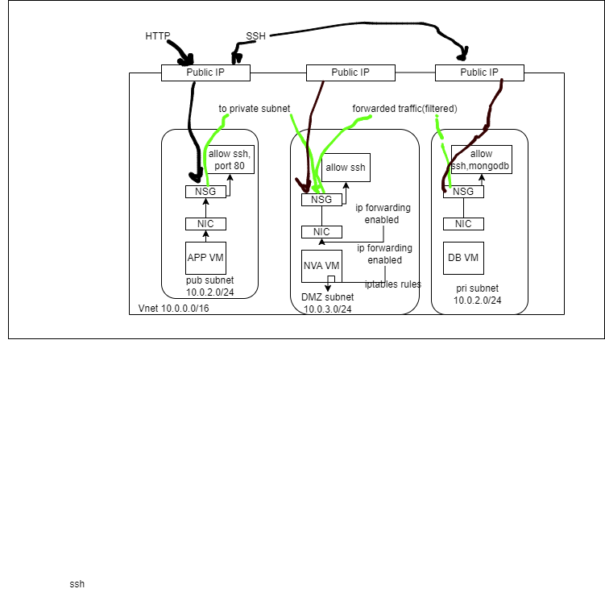

# Securing Database Subnet with DMZ in Azure

## Introduction
In Azure networking, implementing a DMZ can enhance security by segregating different tiers of your application architecture. 

## Security Groups

In Azure, security groups refer to either Network Security Groups (NSGs) or Azure Security Groups (ASGs), depending on the context. In a two-tier architecture:

- **Presentation Tier**: Typically, NSGs are used to control inbound and outbound traffic to and from the presentation tier. These security groups define rules that allow or deny traffic based on criteria such as source IP address, destination IP address, port numbers, and protocols.

- **Data Tier**: NSGs are commonly used to secure the data tier. They restrict inbound traffic to only the necessary ports and protocols, typically allowing access from the presentation tier while blocking direct access from the internet.

## Routing

Routing in a two-tier architecture is relatively straightforward:

- **Within the Virtual Network**: Traffic between the presentation and data tiers typically flows within the same virtual network, allowing for fast and secure communication.

- **To the Internet**: Outbound traffic from the presentation tier may be routed directly to the internet for accessing external services or APIs, while inbound traffic is usually restricted based on security group rules.

## Role of DMZ

Now, let's discuss how implementing a DMZ enhances security in this architecture:

- **Isolation**: By placing resources that need internet access (e.g., web servers) in a separate DMZ subnet, you create isolation between public-facing components and sensitive backend resources. This prevents direct exposure of the data tier to the internet, reducing the attack surface.

- **Controlled Access**: The DMZ subnet can be configured with specific NSG rules to allow only necessary inbound traffic from the internet while blocking unauthorised access.

- **Additional Layer of Defense**: The DMZ acts as an additional layer of defense, intercepting and filtering traffic before it reaches critical backend systems. Even if a component in the DMZ is compromised, the impact on the internal network is limited due to the segregation provided by the DMZ.

- **Enhanced Monitoring and Logging**: By consolidating public-facing resources in the DMZ, it becomes easier to monitor and analyse network traffic, security logs, and potential security incidents. This visibility improves the overall security posture of the architecture.

## Prerequisites
- Azure subscription
- Basic understanding of Azure Virtual Networks and Subnets
- Knowledge of Azure Security Groups and Network Security Groups

## Conclusion
By implementing a DMZ architecture in Azure, you can effectively secure your database subnet by segregating resources and controlling access to sensitive data. Following these steps will help enhance the security..
