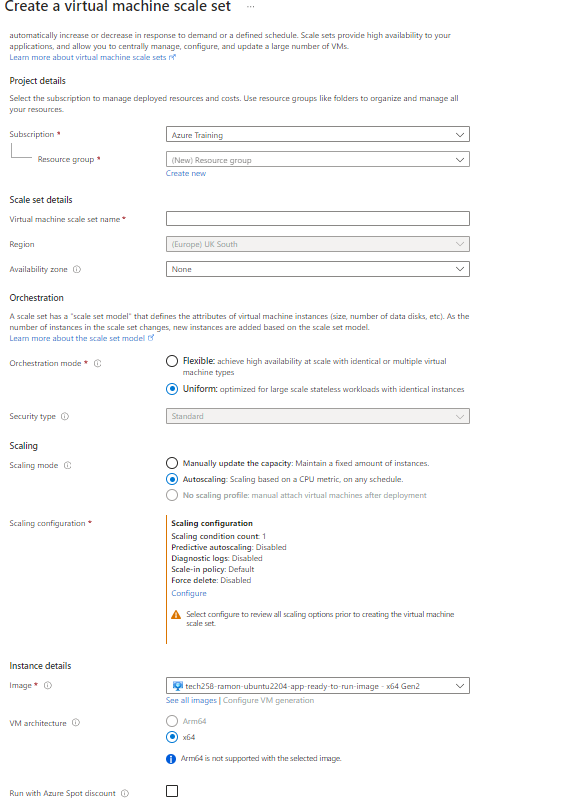
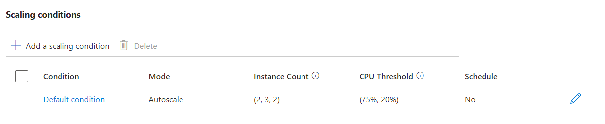
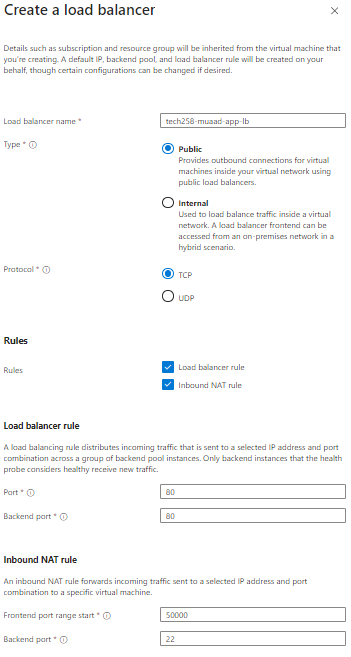

# VM Scale Set Deployment Guide

## Preparing for VM Scale Set Creation:

1. **Plan Resources:**
   - Determine the VM size, image, and other configurations needed for your application.
   - Ensure that your Azure subscription has the necessary resources available.

2. **Test the Application:**
   - Ensure that your application works as expected on a single VM.
   - Test the scalability and performance of your application to understand potential bottlenecks.

3. **Networking Configuration:**
   - Set up virtual networks, subnets, and security groups as needed for your VMs.

## Creating VM Scale Set:

1. **Azure Portal:**
   - Navigate to the Azure Portal.
   - Click on "Create a resource" and search for "Virtual Machine Scale Set".
  
  Make sure Availability Zones 1,2,3 are selected.
- Follow the wizard to configure the VM Scale Set, including VM size, image, networking, and scaling options.
- Scaling Options 
  
- Now create your load balancer.
  
- In the Health section, enable application health monitoring and enable automatic repairs boxes.
- In the Advanced section, add the User Data.
- Then Create the VM
  

## Managing Instances:

- **Reimaging:** Reimaging a VM restores it to its original state using the base image. This process removes any changes made to the VM since its creation. This allows you to make changes to the user data.


## SSH into an Instance in VM Scale Set:

1. **Using Azure Portal:**
   - Navigate to the VM Scale Set in the Azure Portal.
   - Select an instance from the list and click on "Connect".
   - Follow the instructions to SSH into the selected instance.
  
  ``` ssh -i ~/.ssh/tech258-muad-az-key -p 50001 adminuser@"Load Balancer IP"```

  - This is the command we use to use ssh in. The "50001" is used as the port range starts is 5000 so we use 50001.

## Deleting VM Scale Set and Associated Resources:

1. **Azure Portal:**
   - Navigate to the VM Scale Set in the Azure Portal.
   - Select "Delete" and confirm the deletion. This will delete all associated resources.


