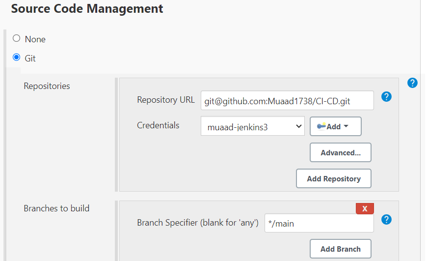

# Setting Up CI/CD Pipeline Using Jenkins for Node.js Project

## Create a New Jenkins Project

1. Navigate to Jenkins dashboard.
2. Click on "New Item" to create a new project.
3. Enter a name for the project.
4. Select the project type, Freestyle project
5. Click "OK" to create the project.

## Link Your GitHub Repository

1. Enter the URL of your GitHub repository.


## Choose Where This Project is Going to Run

- We are going to use Sparta-ubuntu-node. This will have ubuntu and node installed.


## Source Code Management

1. In the project configuration, ensure that Git is selected as the SCM.
2. Link your git repo ssh link.
3. Create a new and add your private ssh key.
4. Configure branches to build as needed (e.g. main branch).
5. Save the configuration.



## Add a Webhook and Link It

1. In your GitHub repository settings, navigate to "Webhooks".
2. Click on "Add webhook" or "Create webhook".
3. Enter the Payload URL (Jenkins webhook URL).
4. Choose the events to trigger the webhook (e.g., push events).
5. Save the webhook configuration.

    

## Specify the Node.js and npm Folders

1. In the project configuration, go to "Build Environment" section.
2. Set environment variables.
3. Save the configuration.

    

## Build the App Using Shell Commands

1. In the project configuration, go to "Build" section.
2. Choose "Execute shell" as the build step.
3. Enter the shell commands to build your Node.js application.
4. Example:
    ```bash
    cd app
    npm install
    npm test
    ```
5. Save the configuration.

    

## Run the Jenkins Job

1. Trigger the Jenkins job manually or wait for the webhook to be triggered.
2. Monitor the build progress in the Jenkins dashboard.
3. If the build is successful, proceed with deployment or other post-build actions.

## Conclusion

You've successfully set up a CI/CD pipeline using Jenkins for your Node.js project! Jenkins will now automatically build and test your application whenever changes are pushed to your GitHub repository.
